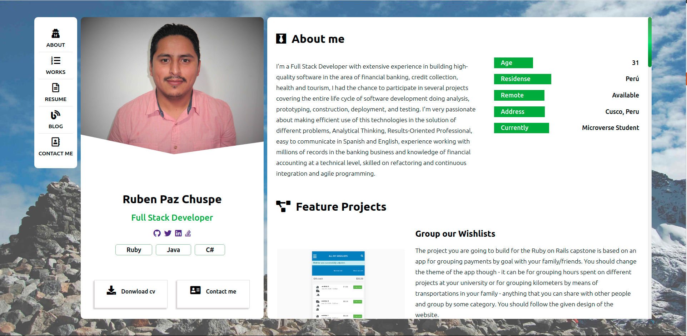

# Building a portfolio project using HTML & CSS path

## Project specifications

This project was built to show my personal information about my path like a software developer using different modern tech, on this project I will like to show some of my fancy projets, I used HTML, CSS, and SASS, stickler, flexbox.    

<!-- TABLE OF CONTENTS -->
## Table of Contents

* [Whats is included on this project](#whats-is-included-on-this-project)
* [Built With](#built-with)
* [Screenshot](#screenshot)
* [Live Demo](#live-demo)
* [SASS structure](#SASS-structure)
* [Video Presentation of the project](#video-presentation-of-the-project)
* [Authors](#authors)
* [Acknowledgements](#acknowledgements)
* [Contributing](#-Contributing)
* [License](#license)

## Whats is included on this project

This project includes the next parts:

+ The home page 
  + Navigation bar
  + Profile info
  + About me
  + Exprience and Education
  + Project
  + Articles
  + Contact

## Built With

Concepts used on this project

- HTML
- CSS
- SASS 
- Javascript
- font-awesome

Tools used on this project

- Stickler CI
- Visual Studio Code
- CSS Formatter
- Stylelint

## Screenshot

## Live Demo

You can see the [live preview](http://rpazchuspe.haylli.net/)

## SASS structure 

For this project, I use SASS for managing CSS behavior and have the next structure.

* CSS
* fonts
* img
* js
* scss

For making changes to this project you should run SASS with this command

1. Go to the file where your project is located C:/www/project_root
2. sass --watch scss:css
3. Change files located on SCSS folder

## Video Presentation of the project

You can see the video presentation on the next link [here](https://www.youtube.com/watch?v=SWB-fzTpx5g&t=49s).

## Authors

👤 **Ruben Paz Chuspe**

- Github: [@rubenpazch](https://github.com/rubenpazch)
- Linkedin: [rubenpch](https://www.linkedin.com/in/rubenpch/)
- Twitter: [chuspepaz](https://twitter.com/ChuspePaz)

## Contributing

This is an education project as a part of the Microverse so contributing is not accepted. 

Contributions, issues and feature requests are welcome!

Feel free to check the [issues](https://github.com/rubenpazch/my_portfolio/issues).

## Show your support

Give a ⭐️ if you like this project!

## Acknowledgements

+ [Microverse](https://www.microverse.org/).
+ [Github](http://github.com/).
+ [Fontawesome](http://fontawesome.com/).
+ [The Odin Project](theodinproject.com/).

## License

This project is [MIT](lic.url) licensed.

